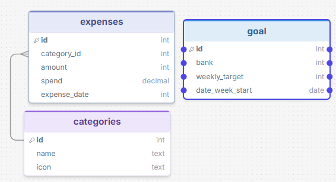
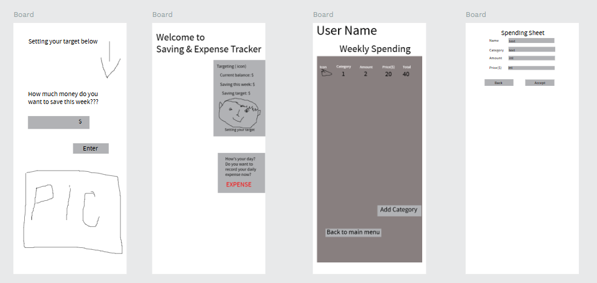

# Sprint 1 - Developing a DB and UI Prototype

## Sprint Goals
The database is designed to store user information, daily expenses, weekly savings goals, and weekly summaries while reducing duplicated data.

Develop a design for the database and a UI prototype that simulates the key functionality of the system. Test and refine the UI so that it can serve as the model for the next phase of development in Sprint 2.

### Specific Goals

**Edit these goals as needed**

- Design the database:
    - Tables
    - Fields / types
    - Primary keys
    - Default / nullable values
    - Relationships (foreign keys)
- Design the UI
    - Key pages
    - User interactions and 'flow'
    - Page layouts / features
    - Colour palette
    - Etc.

## Initial Database Design

Replace this text with notes regarding the DB design.

### Required Data Input

The user will enter:

What they spent money on.
The type/category of the expense.
The amount spent.
The date of the expense.
Their weekly savings target.
Their available or starting amount of money.

### Required Data Output

The system will display:

The user's total spending for the week.
The amount of money remaining.
The amount saved.
The user's weekly savings target.
Progress towards the savings target.
A warning when savings are close to or below the target.
A weekly summary at the end of the week.

### Required Data Processing

total money = spending x amount
total spending = sum of all expense amount
money left = initial money - total spending
money saved = money left
savings progress = money saved compare to the weekly savings target

## UI 'Flow'

The first stage of prototyping was to explore how the UI might 'flow' between states, based on the required functionality.

This PenPot demo shows the initial design for the UI 'flow':

You can acess the flow [here](https://design.penpot.app/#/view?file-id=3be9e5e1-190f-8090-8008-705aa457ca4e&page-id=3be9e5e1-190f-8090-8008-705aa457ca4f&section=interactions&index=0&share-id=c269caa0-e456-818c-8008-88de1439d378)

### Testing

The initial UI flow was tested by following the main user tasks step by step. The test focused on whether a user could understand where to start, add an expense, set a savings target, return to the home screen, and view their progress. Make sure it connected

### Changes / Improvements

-Making the Add Expense button easier to find.
-Reducing the number of steps required to record an expense.
-Making the savings target easier to access and edit.
-Adding clearer navigation between the home screen, expense screen, and weekly summary.
-Showing the user's savings progress on the main screen.

*IMPROVED FIGMA FLOW - PLACE THE FIGMA EMBED CODE HERE - MAKE SURE IT IS SET SO THAT EVERYONE CAN ACCESS IT*

## Initial UI Prototype

The next stage of prototyping was to develop the layout for each screen of the UI.

This Figma demo shows the initial layout design for the UI:

*FIGMA PROTOTYPE - PLACE THE FIGMA EMBED CODE HERE - MAKE SURE IT IS SET SO THAT EVERYONE CAN ACCESS IT*

### Testing

Replace this text with notes about what you did to test the UI flow and the outcome of the testing.

### Changes / Improvements

Replace this text with notes any improvements you made as a result of the testing.

*FIGMA IMPROVED PROTOTYPE - PLACE THE FIGMA EMBED CODE HERE - MAKE SURE IT IS SET SO THAT EVERYONE CAN ACCESS IT*

## Refined UI Prototype

Having established the layout of the UI screens, the prototype was refined visually, in terms of colour, fonts, etc.

This Figma demo shows the UI with refinements applied:

*FIGMA REFINED PROTOTYPE - PLACE THE FIGMA EMBED CODE HERE - MAKE SURE IT IS SET SO THAT EVERYONE CAN ACCESS IT*

### Testing

Replace this text with notes about what you did to test the UI flow and the outcome of the testing.

### Changes / Improvements

Replace this text with notes any improvements you made as a result of the testing.

*FIGMA IMPROVED REFINED PROTOTYPE - PLACE THE FIGMA EMBED CODE HERE - MAKE SURE IT IS SET SO THAT EVERYONE CAN ACCESS IT*

## Sprint Review

Replace this text with a statement about how the sprint has moved the project forward - key success point, any things that didn't go so well, etc.

